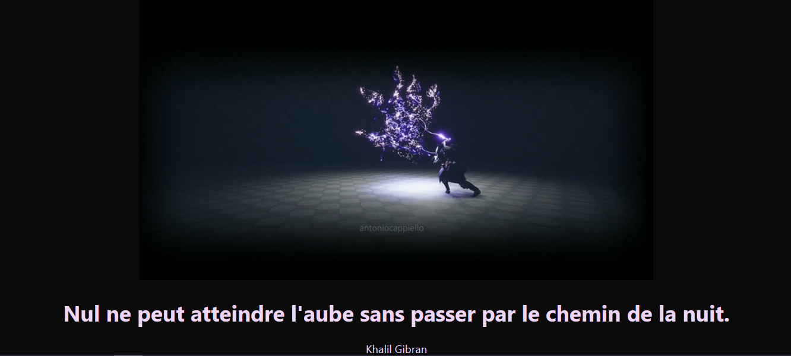

# Ma première application en ligne Réact avec créate-react-app sur GitHub. 
*(super pour les débutants)*

[Découvrir le tuto](https://youtu.be/ziPzOp6j0Oo).

[Découvrir ici](https://franckdun.github.io/react-deploy-001/).

